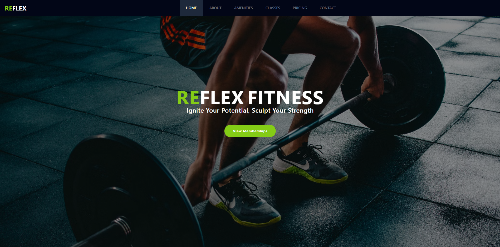

# Reflex Fitness - React Front-End Site

#### [Reflex Fitness Site](https://reflex-gym-site.netlify.app/)
### Author:
Hunter Bernier
### Description:
This is a gym site that I designed for my first React Project. It incorporates six pages: Home, About, Amenities, Classes, Pricing, and Contact using React-Router-DOM. Each page incorporates unique styling and detailed information about each section (no filler text).
### Languages and Libraries Used:
- React
- JavaScript
- HTML
- Tailwind
- React-Router-DOM